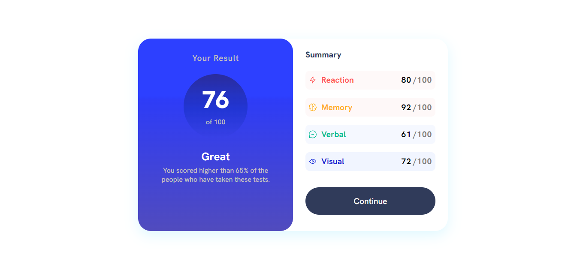

<!-- @format -->

# Frontend Mentor - Results summary component solution

This is a solution to the [Results summary component challenge on Frontend Mentor](https://www.frontendmentor.io/challenges/results-summary-component-CE_K6s0maV). Frontend Mentor challenges help you improve your coding skills by building realistic projects.

## Table of contents

- [Overview](#overview)
  - [The challenge](#the-challenge)
  - [Screenshot](#screenshot)
  - [Built with](#built-with)
  - [What I learned](#what-i-learned)
  - [Continued development](#continued-development)
- [Author](#author)

**Note: Delete this note and update the table of contents based on what sections you keep.**

## Overview

### The challenge

Users should be able to:

- View the optimal layout for the interface depending on their device's screen size
- See hover and focus states for all interactive elements on the page

### Screenshot

### Built with

- Semantic HTML5 markup
- CSS custom properties
- Flexbox
- CSS Grid
- Mobile-first workflow

### What I learned

This is a tricky one to get right for responsiveness...

No help on this one... no looking up solutions or copying at all, so pretty pleased, (although it did take a couple of hours longer than it should)

### Continued development

Need to continue to practice use of flex / grid to ease my understanding of layout challenges.

## Author

- Website - [James Dennis](https://jamesdennis.org)
- Frontend Mentor - [@James Dennis](https://www.frontendmentor.io/profile/jamesdennis)
